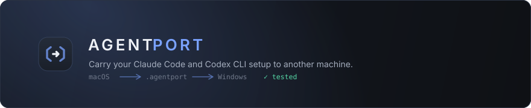
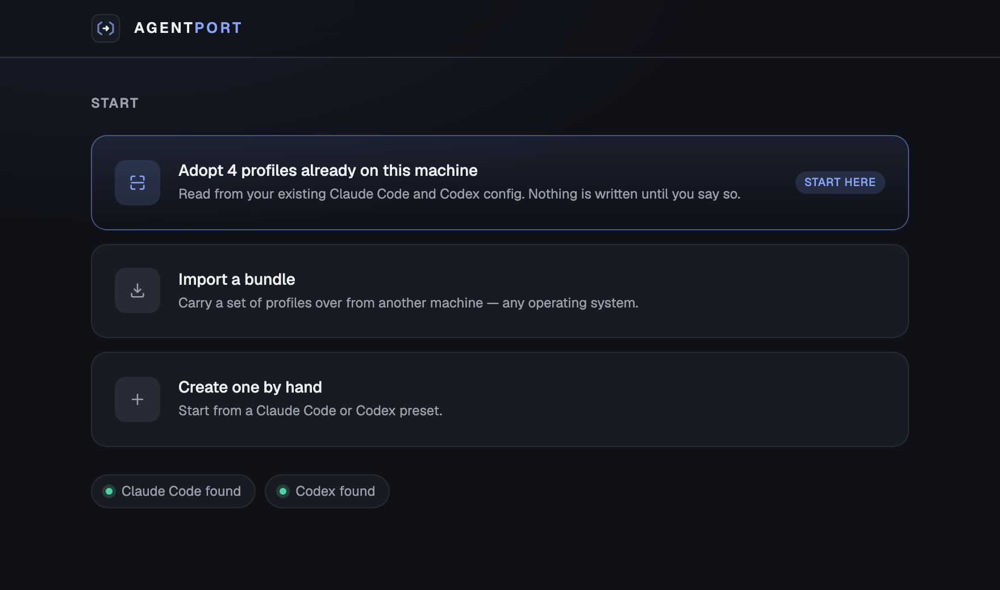
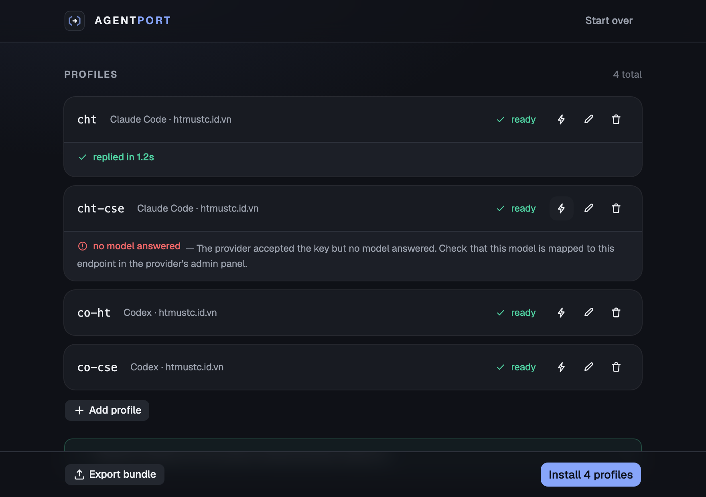
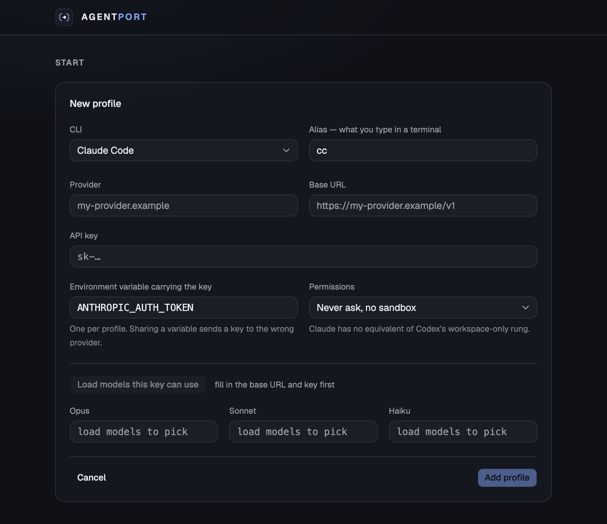

<div align="center">



<br>

**Carry your Claude Code and Codex CLI setup to another machine — across operating systems.**
<br>Export, import, test, done.

<br>

[](https://github.com/innovatorsk3/agentport/releases/latest)
[](https://github.com/innovatorsk3/agentport/actions)


<br>

[Install](#-install) · [How it works](#-how-it-works) · [Why it exists](#-why-it-exists) · [Docs](#-documentation)

</div>

<br>

> [!WARNING]
> Bundles carry your API keys **in plaintext**. That is deliberate — this is an internal tool and the keys have to travel readable. **Never commit a bundle file.**

<br>

## 🎯 The problem

You have Claude Code and Codex dialled in on one machine: several providers, an alias per provider, permission bypass on so you never type `--dangerously-skip-permissions` again.

Now you are at a different machine. Possibly a different operating system.

Redoing it by hand takes an afternoon, and the failures along the way are **silent**. A config key nested one level too high is ignored without an error. A key loaded into the wrong environment variable still runs. A provider returns `200 OK` on one endpoint and hangs on another.

<br>

## ⚡ Install

Every release publishes builds under **stable filenames**, so a fresh machine can fetch one without opening a browser.

<table>
<tr>
<td width="34%"><b>🪟 Windows</b></td>
<td>

```powershell
curl.exe --fail --location --show-error -o agentport-setup.exe https://github.com/innovatorsk3/agentport/releases/latest/download/agentport-windows-x64.exe
.\agentport-setup.exe
```

</td>
</tr>
<tr>
<td><b>🍎 macOS</b><br><sub>swap <code>arm64</code> → <code>intel</code></sub></td>
<td>

```bash
curl --fail --location --show-error -o agentport.dmg https://github.com/innovatorsk3/agentport/releases/latest/download/agentport-macos-arm64.dmg
open agentport.dmg
```

</td>
</tr>
<tr>
<td><b>🐧 Linux</b></td>
<td>

```bash
curl --fail --location --show-error -o agentport.AppImage https://github.com/innovatorsk3/agentport/releases/latest/download/agentport-linux-x64.AppImage
chmod +x agentport.AppImage && ./agentport.AppImage
```

</td>
</tr>
</table>

<details>
<summary><b>Neither build is code-signed</b> — what you will see on first run</summary>

<br>

**Windows** — SmartScreen blocks it: *More info → Run anyway*.

**macOS** — right-click the app → *Open*, or System Settings → Privacy & Security → *Open Anyway*.

A code-signing certificate is the only thing that removes those prompts, and for an internal tool it is not worth the yearly fee. macOS builds are **ad-hoc signed** so Apple Silicon does not report them as *"damaged"* — which reads as a corrupt download rather than a security prompt, and sends people looking in the wrong place.

</details>

<br>

## 🔍 How it works

### 1 · It looks before it asks



The scan runs on launch, so the app already knows what is on this machine. The three ways in are **not** equal — on a machine with existing config, adopting is right almost every time, and that is the one it points at.

<br>

### 2 · Every profile is tested for real



Both rows above say **ready** — the CLI is installed, the config is valid. One works. One does not.

That difference is invisible until something actually makes a call, which is why testing is one click per row and does not require installing anything first.

<br>

Three failures produce the same *"it does not work"* symptom and demand completely different responses:

| | Meaning | What you do |
|:--|:--|:--|
| **`401`** | Wrong key | Paste a different one |
| **`402`** | Out of credit | Top up |
| **timeout · `500`** | No model mapped to this endpoint | Fix it in the provider's admin panel |

The third one costs twenty minutes of `curl` to identify by hand.

<br>

### 3 · Model mappings are verified, not typed



A profile pointing at a model the provider does not serve looks **completely correct** in both CLIs and fails only at call time. agentport fetches the real `/v1/models` list for that key and checks the mapping against it.

> Found on the developer's own machine while building this: two Claude profiles configured for `claude-opus-5`, against a provider serving 14 models and **not one Claude model among them**. Neither CLI says a word about it.

<br>

## 📦 Carrying a setup to a new machine

<table>
<tr><td width="50%" valign="top">

**On the machine that already works**

`1` Open agentport — it scans and offers what it finds
<br>`2` **Export bundle** → save the `.agentport` file

</td><td valign="top">

**On the new machine**

`3` Download and run agentport
<br>`4` **Import a bundle** → pick that file
<br>`5` **Install** → writes config, registers one shell line, tests every profile

</td></tr>
</table>

Open a new terminal. Your aliases are there.

<br>

## 🧭 Why it exists

Several tools already switch providers for Claude Code. agentport is not competing there:

| | Provider switchers | agentport |
|:--|:--:|:--:|
| Switch provider on one machine | ✅ | — |
| Carry a setup **across machines and operating systems** | ❌ | ✅ |
| **Scan** a machine for profiles that already exist | ❌ | ✅ |
| Test with a **real generation call**, then classify the failure | ❌ | ✅ |
| Verify model ids against what the provider **actually serves** | ❌ | ✅ |

<br>

### Three principles

<table>
<tr><td width="33%" valign="top">

**🔒 It does not own your shell rc**

Your `.zshrc` — or `$PROFILE` on Windows — receives exactly **one line, once**. Uninstalling means deleting that line.

</td><td width="33%" valign="top">

**🧬 A bundle stores intent, not files**

No absolute paths, no verbatim CLI JSON or TOML. The destination translates intent into whatever schema its installed CLI expects. That is what makes macOS → Windows work.

</td><td width="33%" valign="top">

**🏷️ It owns the name, not the thing named**

It creates aliases. It never rewrites your default CLI config or your existing auth.

</td></tr>
</table>

<br>

## 🛠️ Built with

<table>
<tr>
<td width="30%"><b>Tauri v2</b></td>
<td>~4 MB, system webview — no bundled Chromium for an app that writes config files</td>
</tr>
<tr>
<td><b>Rust</b></td>
<td>Filesystem, CLI detection, HTTP probes. Every dangerous operation behind one narrow surface</td>
</tr>
<tr>
<td><b>React · TypeScript · shadcn/ui</b></td>
<td>Three screens, fluid from 560 px up</td>
</tr>
</table>

```bash
git clone https://github.com/innovatorsk3/agentport && cd agentport
pnpm install
pnpm tauri dev                  # run it
cd src-tauri && cargo test      # unit + integration tests
```

<br>

## 📚 Documentation

- **[Requirements](docs/requirements.md)** — the full specification, with the evidence behind every decision
- **[Tech stack & build](docs/techstack.md)** — architecture, CI, code signing

<br>

## Licence

Undecided.

<br>

<div align="center">
<sub>Every requirement in the spec traces to a real failure observed while building this — not to a guess.</sub>
</div>
